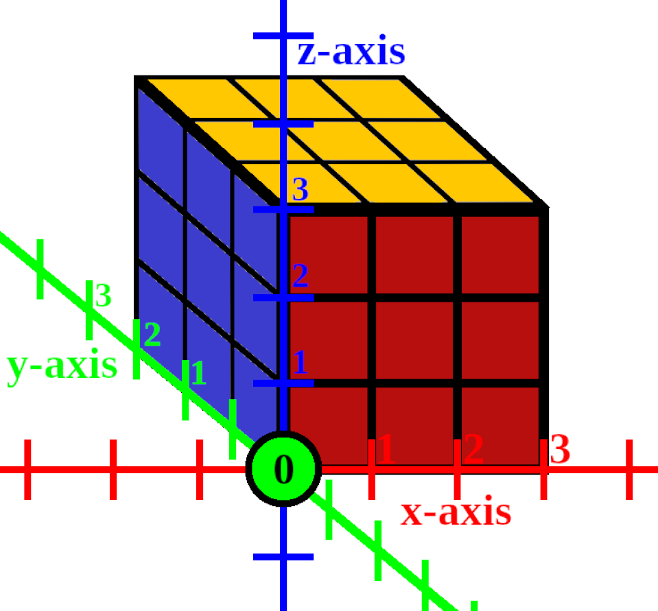

# NxNxN Rubik's cube simulator
This project simulates NxNxN Rubik's cubes.

## The axis-offset movement notation
To allow moves on arbitrarily sized cubes, a new notation must be specified: an **axis**, an **offset** from the origin, and the **direction** of the rotation.

- **Axis:** one of the axes in the 3D coordinate space: **x**, **y**, or **z**.
- **Offset:** a nonnegative integer that specifies the slice (row or column) to rotate. Its value is the layer's distance from the origin.
- **Origin:** The subcube that is found at the cube's leftmost column, lowest row, at the closest position. Its position doesn't change.
- **Direction:** a boolean flag that specifies whether to rotate the selected slice in a clockwise or a counter-clockwise direction. By default, it is set to **false**, meaning that rotation is done in a clockwise manner.

### Writing format

Using the axis-offset notation, moves are written in the following format:

`<axis><offset>[<counter-clockwise>]`, where
- **axis** is the letter **x**, **y**, or **z**
- **offset** is an arbitrary nonnegative integer
- **counter-clockwise** is an optional `'` character (single-quote)

#### Examples:
- `x0`: Rotate the **first layer** from the origin in the **x-axis** in a **clockwise** direction.
- `x0'`: Rotate the **first layer** from the origin in the **x-axis** in a **counter-clockwise** direction.
- `y11`: Rotate the **twelfth layer** from the origin in the **y-axis** in a **clockwise** direction.
- `z2'`: Rotate the **third** layer from the origin in the **z-axis** in a **counter-clockwise** direction.

> [!NOTE]
> Offsets start from zero.

### Translation from traditional notation

Each traditional, single-layer move has an **axis-offset** counterpart. Wide moves can be represented by chaining together multiple moves for each affected layer. Repeating moves, such as double moves, can be represented with two or more of the same move.

With NxNxN cubes, the offset can take up any value from the range `[0, N)`. The first layer is specified by an offset of **0**, the last by an offset of **N-1**. Every possible cube is a 3D object, so the possible axes are still **x**, **y**, or **z**.

With 2x2x2 cubes, the offset can range from 0 to 1, as there are two layers to pick from. The translation from traditional notation to axis-offset notation of each possible move of a 2x2x2 cube is as follows:

|Traditional|Axis-offset|
|-----------|-----------|
|U          |z1'        |
|U'         |z1         |
|D          |z0         |
|D'         |z0'        |
|L          |x0         |
|L'         |x0'        |
|R          |x1'        |
|R'         |x1         |
|F          |y0         |
|F'         |y0'        |
|B          |y1'        |
|B'         |y1         |

Using larger cubes, we have more possible moves. Here's the translation table for 3x3x3 cubes:

|Traditional|Axis-offset|
|-----------|-----------|
|U          |z2'        |
|U'         |z2         |
|D          |z0         |
|D'         |z0'        |
|L          |x0         |
|L'         |x0'        |
|R          |x2'        |
|R'         |x2         |
|F          |y0         |
|F'         |y0'        |
|B          |y2'        |
|B'         |y2         |
|M          |x1         |
|M'         |x1'        |
|E          |z1         |
|E'         |z1'        |
|S          |y1         |
|S'         |y1'        |

Note that the offset range increased by one, and to refer to the last layer (as in U or B), we need to supply `N-1` as the offset.
